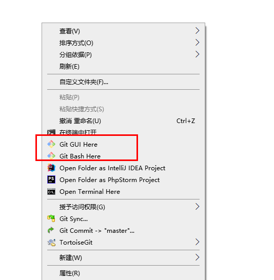
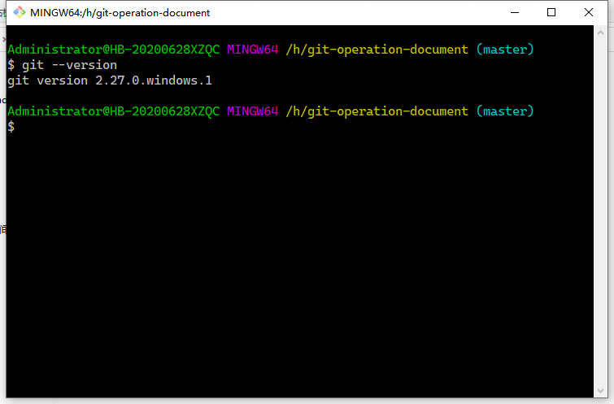

# Git?

> 分布式版本控制系统。
>
> 2008年，GitHub网站上线，它为开源项目免费提供Git存储，无数开源项目开始迁移至GitHub。


在整个项目的开发过程中，总会不停的修改代码。


某一天，想要查看之前某个时间点的代码，如果没有版本控制器，怎么办？


某一天，想要对比某两个时间点上代码的差异，没有版本控制器，怎么办？


## GIT 和 SVN

- git 分布式版本控制系统
  - 不用联网也可以管理，版本库保存在各自的电脑上
- SVN中央版本控制系统
  - 需要联网，版本库保存在中央服务器上


# 安装

> Git下载地址：https://git-scm.com/download/win

下载完安装包之后，双击 EXE 安装包，可以看到如下图窗口界面，一直点击`Next`安装即可。


在安装完成之后，会在你的右键菜单栏中增加一个`Git`的选项，你可以在电脑桌面点击鼠标`右键`，会看到多出两个菜单，如下图所示：




当你点击`Git bash Here`菜单之后，可以看到一个终端窗口，在终端里面输入命令`git —version`，如果可以看到 git 的版本信息，则说明安装成功，如下图所示：




# 创建本地Git仓库

## 创建版本库


- 首先，创建`test`目录，并进入该目录；
- 使用git终端，执行`git init`命令初始化仓库；


### `.git`目录

在生成的 .git 目录中，里面包含了整个版本库的信息，我们可以通过命令`cd .git && ls -al`进入 .git 文件夹中查看具体有哪些文件：

- `HEAD `文件指示目前被检出的分支
- `branches `新版本已经废弃无须理会
- `description`用来显示对仓库的描述信息
- `config` 文件包含项目特有的配置选项
- `info `目录包含一个全局性排除文件
- `hooks `目录包含客户端或服务端的钩子脚本
- `index `文件保存暂存区信息
- `objects `目录存储所有数据内容
- `refs `目录存储分支的提交对象的指针

## 基础配置

在建立完项目的版本库之后，后续对代码的管理操作都会要求要有一个身份，所以需要你在管理操作之前，配置一个昵称和邮箱，这个昵称和邮箱仅仅是在查看改动记录时候用的。

### 查看配置信息

在设置昵称和邮箱之前，可以先检查一下之前有没有配置过昵称和邮箱
查看昵称的命令如下：

```cmd
git config user.name
```

查看邮箱的命令如下:

```cmd
git config user.email
```

### 设置配置信息

如果执行上面的命令没有返回相应的昵称和邮箱，说明你还没有配置昵称和邮箱。那么就需要进行配置
配置昵称的命令参考如下：

```cmd
git config --global user.name "你的昵称"
```

配置邮箱的命令参考如下：

```cmd
git config --global user.email "你的邮箱"
```

### 修改配置信息

 第一种是通过命令行，第二种是通过修改配置文件：

#### 命令行修改配置

通过命令行修改的方式比较简单，直接执行以下的命令即可
修改昵称参考命令如下：

```cmd
git config --global --replace-all user.name "your user name"
```

修改邮箱地址参考命令如下：

```cmd
git config --global --replace-all user.email"your user email"
```


