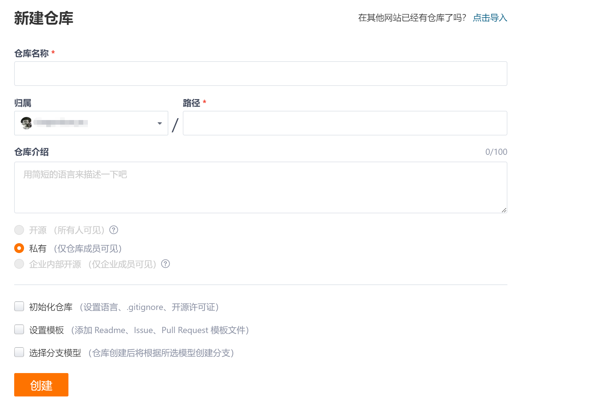
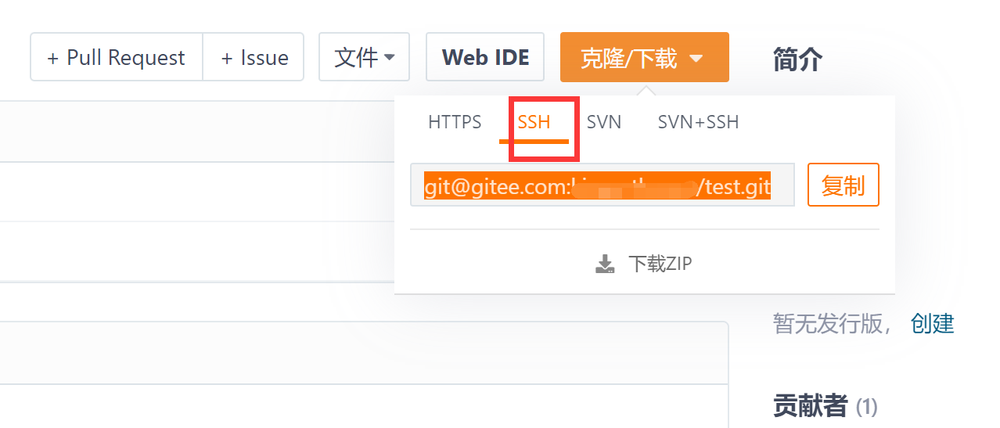

# Git?

> 分布式版本控制系统。
>
> 2008年，GitHub网站上线，它为开源项目免费提供Git存储，无数开源项目开始迁移至GitHub。


在整个项目的开发过程中，总会不停的修改代码。


某一天，想要查看之前某个时间点的代码，如果没有版本控制器，怎么办？


某一天，想要对比某两个时间点上代码的差异，没有版本控制器，怎么办？


## Git 和 SVN

- git 分布式版本控制系统
  - 不用联网也可以管理，版本库保存在各自的电脑上
- SVN中央版本控制系统
  - 需要联网，版本库保存在中央服务器上


# 安装Git

> Git下载地址：https://git-scm.com/download/win

下载完安装包之后，双击 EXE 安装包，可以看到如下图窗口界面，一直点击`Next`安装即可。


在安装完成之后，会在你的右键菜单栏中增加一个`Git`的选项，你可以在电脑桌面点击鼠标`右键`，会看到多出两个菜单，如下图所示：


当你点击`Git bash Here`菜单之后，可以看到一个终端窗口，在终端里面输入命令`git —version`，如果可以看到 git 的版本信息，则说明安装成功，如下图所示：


# 创建本地Git仓库

## 创建版本库


- 首先，创建`test`目录，并进入该目录；
- 使用git终端，执行`git init`命令初始化仓库；


### `.git`目录

在生成的 .git 目录中，里面包含了整个版本库的信息，我们可以通过命令`cd .git && ls -al`进入 .git 文件夹中查看具体有哪些文件：

- `HEAD `文件指示目前被检出的分支
- `branches `新版本已经废弃无须理会
- `description`用来显示对仓库的描述信息
- `config` 文件包含项目特有的配置选项
- `info `目录包含一个全局性排除文件
- `hooks `目录包含客户端或服务端的钩子脚本
- `index `文件保存暂存区信息
- `objects `目录存储所有数据内容
- `refs `目录存储分支的提交对象的指针

## 基础配置

在建立完项目的版本库之后，后续对代码的管理操作都会要求要有一个身份，所以需要你在管理操作之前，配置一个昵称和邮箱，这个昵称和邮箱仅仅是在查看改动记录时候用的。

### 查看配置信息

在设置昵称和邮箱之前，可以先检查一下之前有没有配置过昵称和邮箱
查看昵称的命令如下：

```shell
git config user.name
```

查看邮箱的命令如下:

```shell
git config user.email
```

### 设置配置信息

如果执行上面的命令没有返回相应的昵称和邮箱，说明你还没有配置昵称和邮箱。那么就需要进行配置
配置昵称的命令参考如下：

```shell
git config --global user.name "你的昵称"
```

配置邮箱的命令参考如下：

```shell
git config --global user.email "你的邮箱"
```

### 修改配置信息

 第一种是通过命令行，第二种是通过修改配置文件：

#### 命令行修改配置

通过命令行修改的方式比较简单，直接执行以下的命令即可
修改昵称参考命令如下：

```shell
git config --global --replace-all user.name "your user name"
```

修改邮箱地址参考命令如下：

```shell
git config --global --replace-all user.email"your user email"
```


#### 文件修改配置

Windows 系统位于用户主目录下，假设你当前的用户是`administrator`，那么对应的配置文件的路径应该是 `C:\Users\administrator\.gitconfig`，可以直接使用记事本修改里边的 name 或者 email。


# 拉取远端代码

> 使用Git命令下载远程仓库到本地


## 创建远程代码仓库

### 注册账号

略...

### 创建仓库




### 进入仓库


接下来我们通过 git 的命令将远程仓库拉取到本地，一般会提供 HTTP 协议和 SSH 两种协议提供管理，两种协议所使用的鉴权方式不同，下面我们将两种方法都实践一次。

## HTTP(S)获取远程仓库

>  直接执行 git 的 clone 命令即可。

### 首次拉取

执行命令：

```shell
git clone 版本库地址	[本地文件夹名称]
```

在如图的位置获取版本库的地址：


命令执行完成后，会要求你输入用户名和密码，只有当你输入正确的用户名和密码之后代码才能正常拉取。

### 更新代码

假设远程代码有变更，你想把本地代码更新时，可以在本地的版本库目录下通过`git pull`命令更新，不需要再指定远程地址，参考命令如下

```shell
git pull
```

**默认情况下会再次提示你输入密码，因为 git 默认没有缓存 HTTP 认证权限.**

### 临时记住密码


如果你不想每次都输入 git 的认证信息，可以设置缓存认证数据，默认记住 15 分钟，如下命令所示：

```shell
git config –-global credential.helper cache
```

如果你想缓存更长时间，也可以指定缓存时长，比如下面是自定义配置记住 1 小时的命令：

```shell
git config credential.helper ‘cache –timeout=3600’
```

### 永久记住密码

如果你不想每次提交代码都要输入用户名密码，也可以让 Git 永久记住密码，参考命令如下所示

```shell
git config --global credential.helper store
```

命令执行完毕之后，会在当前用户主目录的`.gitconfig`文件中新增一项配置，配置如下所示

```shell
[credential]
    helper = store
```

在上面的命令中，如果没有`--global`，则会在当前项目下的`.git/config`文件增加配置

从这里可以看出， git 永久记住密码其实是根据配置文件所决定，所以你也可以直接复制上面生成的配置到配置文件中。


##  SSH拉取

相比HTTP(S)来说更加安全,因为SSH方式使用的是非对称加密，采用公钥与私钥的方式，不过相对来说配置起来会麻烦一些；好处是一次配置之后，后续不需要每次都进行认证，也更加安全。


### 尝试拉取代码




因为并没有配置公钥与私钥，所以拉取代码并没有成功。


### 创建一个ssh key

通过 ssh 协议拉取代码首先要保证当前用户的主目录存在一个`.ssh`的文件夹，并且里面已经存在私钥文件，如果没有的话我们可以通过`ssh-keygen`，生成一份公钥与私钥，如下命令所示：


所有的交互均使用回车，采用默认选项。

最终会在当前用户目录下生成公钥和私钥，查看生成的公钥的命令为`cat ~/.ssh/id_rsa.pub`,在返回的信息中可以看到类似如下信息：


也可以直接看到保存的位置：


### 添加公钥到服务器

当确认公钥和私钥生成完毕之后，我们还需要将公钥放到远程的 git 仓库中去，在码云的版本库中，右上角有一个管理，在管理页面的左侧菜单中有一个添加公钥的选项，我们将上面的公钥内容复制进去，如下图所示：


### 拉取代码

当公钥添加进去之后，就已经完成了权限配置，此时我们再次使用ssh方式拉取代码，就不会提示没有权限，执行结果如下所示：


### 更新代码

ssh 方式更新代码命令和上面的 http 方式拉取代码命令一致，同样需要在目录下执行命令：`git pull`。


# 提交代码

> 将本地仓库的代码，提交到远程仓库中。


正常情况下，我们会先建好远程仓库，然后拉取到本地，这样，远程仓库地址就能自动和我们的本地仓库关联。


## 本地仓库关联远程仓库

### 已有本地仓库

这种情况下，我们只要将远程仓库和本地仓库关联即可：

```shell
cd existing_git_repo
git remote add origin git@gitee.com:xxxx/test.git
git push -u origin "master"
```

### 没有本地仓库

需要创建本地仓库，然后关联到远程仓库：

```shell
mkdir test
cd test
git init 
touch README.md
git add README.md
git commit -m "first commit"
git remote add origin git@gitee.com:xxx/test.git
git push -u origin "master"
```

### 修改远程仓库地址

- 方式1

```csharp
git remote -v  #查看远端地址
git remote #查看远端仓库名
git remote set-url origin https://gitee.com/xx/xx.git (新地址)
```

- 方式2

```csharp
git remote rm origin #删除远程的仓库
git remote add origin  https://gitee.com/xx/xx.git(新地址) #重新添加远程仓库
```

- 方式3

直接修改`.git`目录下的`config`文件：


## 同步远程代码

一个远程仓库有可能有多人有权限推送，所以存在远程代码比你本地仓库更新，因此在提交代码之前需要先拉取服务器代码，让本地仓库保持最新的版本记录；这样做的目的是为了防止当你提交代码之后，推送到远端出现代码冲突问题，拉取远程代码参考命令如下所示：

```shell
git pull 
```

**在修改本地代码之前，先同步远程代码！！！**


## 检查改动文件

```shell
git status 
```


在终端执行完命令之后，可以看到我当前有三个文件有改动，有删除的、有添加的、也有修改内容的，图中返回的状态为英文，这里给大家翻译一下，状态有下面这几种：

1. **Untracked**: 未跟踪,一般为新增文件，此文件在文件夹中, 但并没有加入到git库, 不参与版本控制. 通过git add 状态变为Staged.
2. **Modified**: 文件已修改, 仅仅是修改, 并没有进行其他的操作.
3. **deleted**： 文件已删除，本地删除，服务器上还没有删除.
4. **renamed**：文件名称被改变

### 撤销更改

如果发现无意中编辑了某一个文件，但实际上并不想改变它，这里可以使用`git checkout 文件名`来撤销更改，参考命令如下：

```shell
git checkout README.md
```

##  添加文件到缓存

通过检查并将不需要改动的代码恢复后，就可以开始将需要提交的文件添加到暂存区中，添加文件到暂存区可以指定添加文件或目录，或者一次性添加全部改动到缓存。


现在先来看看提交指定文件或目录至缓存的格式，参考命令如下：

```shell
git add doc.txt
```

上面这条命令将会把`doc.txt`这个文件提交到暂存区中去，提交后使用`git status`可以看到它的变化，原本 doc.txt 红颜色的名字变成了绿色，如下图所示：


你也可以使用刚才的命令将目录,提交到缓存中去，参考命令如下：

```shell
git add 目录
```

也可以一次性将所有改动的文件添加到暂存区：

```shell
git add .
```

## 提交代码

当你将所需要提交的代码都添加到缓存区域后，接下来就可以将代码提交到本地仓库中，参考命令如下所示 ：

```shell
git commit . -m "提交说明"
```


## 推送代码

当代码提交之后，在本地的工作就已经完成了，此时为了让其他人拉取你的代码，通常还需要将代码推送到远程仓库，参考命令如下：

```shell
git push
```

# 忽略指定文件或目录

在平时工作中可能需要把一些文件放到 Git 工作目录中，但又不想把他们提交到版本控制器里面，比如说，项目的配置文件、IDE 自己产生的目录文件等等。

在`Git`工作区的根目录下创建一个`.gitignore`文件，把想忽略的文件名或者目录填进去，Git 就会自动忽略这些文件，如下图所示：


```
.DS_Store
node_modules
/dist


# local env files
.env.local
.env.*.local

# Log files
npm-debug.log*
yarn-debug.log*
yarn-error.log*
pnpm-debug.log*

# Editor directories and files
.idea
.vscode
*.suo
*.ntvs*
*.njsproj
*.sln
*.sw?
```

## 常见问题

### 无法添加`.gitignore`

windows下，可能会出现该问题，可使用vscode、idea等来创建。

或者用git的命令行工具执行：`touch .gitignore`创建。


### 添加忽略文件

 `.gitignore` 写得有问题，需要找出来到底哪个规则写错了，可以用`git check-ignore`命令检查：

```shell
git check-ignore -v 文件名
```

Git 会告诉我们，`.gitignore` 的第 几 行规则忽略了该文件，于是我们就可以知道应该修订哪个规则。

除了修改 `.gitignore` 文件的规则之外还可以使用强制添加的方式：

```shell
git add -f 文件名
```

